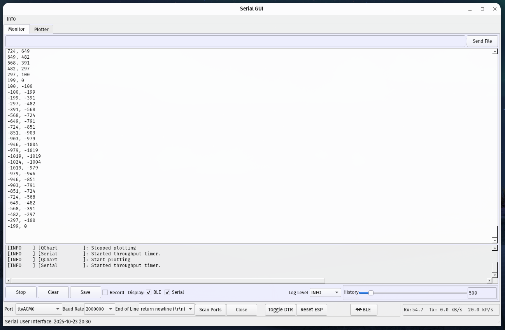
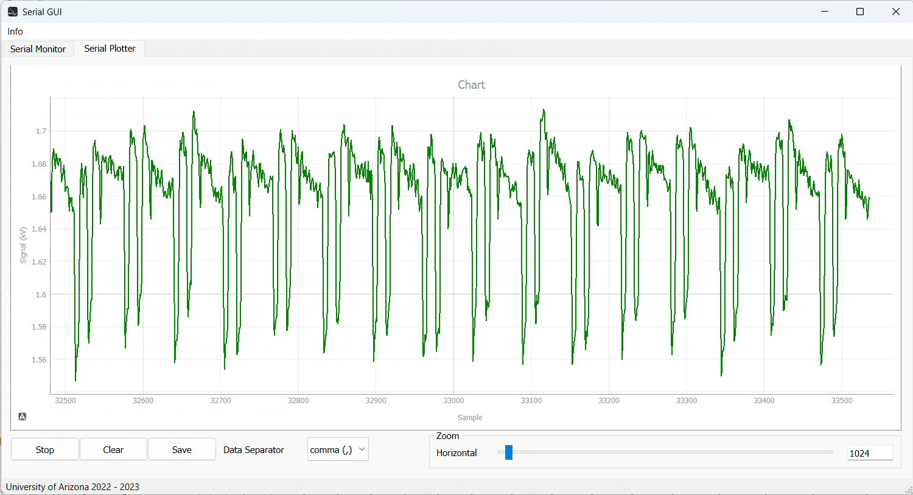
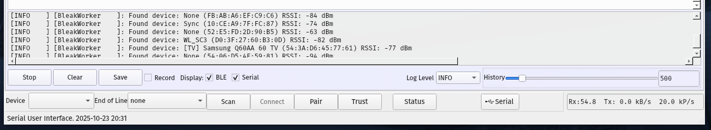

# Graphical User Interface for Serial Communication

 **SerialUI** provides a graphical interface to send and receive text and data through a serial port or BLE connection (Nordic UART Service).

It includes a serial plotter for displaying numerical data.

It offers features beyond other serial terminals. For example, in addition to features found in the Arduino IDE Monitor or Plotter, it offers:
- Serial over BLE (NUS)
- Recording of received data
- Extended charting of the data
  
Throughput is similar to other serial terminal programs.

This program is written in Python using PyQt , Bleak , and PyQtGraph . It also supports fastplotlib .

The main program is `SerialUI.py`. It uses files in the `assets`, `docs`, and `helpers` folders.

For easy use, binaries are available from the Releases page for Windows, Ubuntu, and macOS.

## Video

Video using an ESP32 with the testBLESerial program. Data is transmitted using BLE Serial, and the maximum transfer test shows > 100 kByte/s. The device is initially connected to the application with serial USB and then with serial BLE.

## Description
The program displays text received through a serial connection. It also sends text provided by the user:

The serial monitor interface:

Received data can be parsed and displayed using the Plotter/Chart interface:

The Serial BLE extension allows devices to connect using serial over BLE:

## How to Use This Program

After starting the program with an executable from the release assets or running the program with `python3 SerialUI.py`, please follow:

- [Usage instructions](docs/Instructions.md).
- [Supplemental instructions](docs/Supplementalinstructions.md).

## Installation

### From Executables

Use an executable from the release assets on GitHub. No packages need to be installed, and no source code needs to be downloaded.
However, you need to unzip the archive before running the executable.

#### First run notes
Operating systems may block downloaded executables until you explicitly allow them.

- `Windows`: If SmartScreen appears, use `More info` then `Run anyway`. If needed, unblock the extracted files in PowerShell with `Get-ChildItem .\SerialUI -Recurse -File | Unblock-File`.
- `macOS`: If Gatekeeper blocks launch, right-click the app and choose `Open` once. If still blocked, remove quarantine recursively in shell:
  `xattr -dr com.apple.quarantine /path/to/SerialUI.app`
- `Linux`: After unzip, ensure executable bit is set in shell:
  `chmod +x ./SerialUI/SerialUI`

### From Source

Clone this repository into a folder where you store Python programs and install the packages described below.

To obtain the project, run `git clone https://github.com/uutzinger/SerialUI.git` or download the zipped folder from GitHub.

This program has dependencies. You can install them with `scripts/setup.sh` on Linux and macOS and `scripts\setup.ps1` on Windows.

To activate the C-accelerated parser, use the build script `./scripts/release.sh --build-c-accelerated` or `./scripts/release.ps1 -build-c-accelerated`. This requires a C++ compiler and the Python packages `pybind11` and `setuptools`.

## Enabling / Disabling Features

The program's configuration is stored in `config.py` in the main folder. Here you can enable or disable features such as:
- USE_FASTPLOTLIB: Plotting with fastplotlib instead of pyqtgraph
- USE_BLE: enable serial communication over BLE
- USE_BLUETOOTHCTL: enable pairing and trusting of BLE devices (available on Unix-like systems)

The standalone executable does not provide access to the configuration file because the default config is used to create the executable.

## Modules

The program is organized into [modules](docs/Module_Organization.md):

- General Helper
- Serial Helper
- BLE Helper
- Graph Helper
- Indicator Helper
- Bluetooth Ctl Helper
- Codec Helper

### Nordic UART Service - BLE

The NUS provides a serial interface similar to a regular USB interface for microcontrollers.

The implementation on a microcontroller requires more programming effort than a simple `Serial.print();`, especially if secure connections and automatic reconnection are considered. BLE connections can be optimized for low power, extended distance, or high throughput. The [Arduino_BLESerial library](https://github.com/uutzinger/Arduino_BLESerial) from the author provides example NUS conenctions. A detailed example is the [BLE test program](./Arduino_programs/testBLESerial/testBLESerial.ino) in this repo's Arduino folder which was used to test SerialUI.

With ESP32-S3, a transfer rate of more than 100 kByte/s can be expected when the BLE connection is optimized for high throughput.

### Data Parsing

The data parser extracts values and variable names from lines of text. In addition to the Python version, a C-accelerated version is available. The program uses the following [Data Parsing Approach](docs/Dataparsing.md).

### Binary Data 

Binary data transmission is not yet implemented. However, the codec has been developed and requires integration and example programs. It will use COBS to extract blocks of data and the BinaryStreamProcessor to interpret the received data.

### Indicating Data

Indicating data is not implemented yet: [N.A.](docs/Indicating.md).

### fastplotlib

Fastplotlib itself is under development. A custom `legend.py` file in the Python libraries folder is needed when you enable fastplotlib in the config file. The file replaces the creators' `legend.py`. It needs more work.

During program startup, the library and the chart widget are initialized. This requires building the pipeline for the GPU, which takes 5-10 seconds. During that time, the program might be sluggish.

fastplotlib is not available in the standalone executable and requires customizations. It is useful if you have a GPU and need to display large data sets.

## Arduino Test Programs

The `Arduino_programs` folder contains example programs that simulate data for serial UART and BLE connections. [testBLESerial_taskbased](Arduino_programs/testBLESerial_taskbased/testBLESerial_taskbased.ino) is the latest.  You can use those programs as examples to create your own application.

## Efficiency

A detailed [comparison of SerialUI with other serial IO programs](docs/Efficiency.md) was conducted.

SerialUI is as performant as other good terminal programs. The maximum text transfer rate of an ESP32-S3 over USB is about 800 kBytes/s and 100 kBytes/s over BLE. With a Cortex-M7 (Teensy), we reached about 7 MBytes/s over USB.

With both fastplotlib and pyqtgraph, we can plot two channels with at least 200k samples per second at a 10 Hz plotting refresh rate. When a large display history is needed, fastplotlib with a dedicated GPU is better suited as the plotting engine.

## Packages utilized in this Project

The following libraries are used:

- [asyncio for bleak](https://docs.python.org/3/library/asyncio.html)`**`
- [bleak - BLE](https://github.com/hbldh/bleak)`**`
- [cobs - serial binary](https://github.com/cmcqueen/cobs-python)`****` 
- [fastplotlib - GPU based charting](https://fastplotlib.org/)`***` beta
- [datetime](https://docs.python.org/3/library/datetime.html)
- [difflib - device ID comparison](https://docs.python.org/3/library/difflib.html)
- [html - html display](https://docs.python.org/3/library/html.parser.html)
- [logging](https://docs.python.org/3/library/logging.html)
- [markdown - markdown display](https://python-markdown.github.io/) `o`
- [math](https://docs.python.org/3/library/math.html)
- [numpy - data buffer and display](https://numpy.org/) `o`
- [numba - accelerator](https://numba.pydata.org/)`*`
- [os](https://docs.python.org/3/library/os.html)
- [pathlib](https://docs.python.org/3/library/pathlib.html)
- [platform](https://docs.python.org/3/library/platform.html)
- [pybind11 - text parsing acceleration](https://github.com/pybind/pybind11)`*`
- [PyOpenGL](https://github.com/mcfletch/pyopengl) `o`
- [PyQt5 or 6 - UI](https://www.riverbankcomputing.com/software/pyqt/) `o`
- [pyqtgraph - charting](https://www.pyqtgraph.org/) `o`
- [re - regular expression filter](https://docs.python.org/3/library/re.html)
- [scipy - fft](https://scipy.org/) `****`
- [setuptools](https://github.com/pypa/setuptools)`*`
- [tamp - compressor](https://github.com/BrianPugh/tamp) `****`
- [textwrap - logging](https://docs.python.org/3/library/textwrap.html)
- [time](https://docs.python.org/3/library/time.html)
- [typing](https://docs.python.org/3/library/typing.html)
- [wmi - USB events](https://timgolden.me.uk/python/wmi/index.html) or [pyudev - USB events](https://pyudev.readthedocs.io/en/latest/) `o`
- [zlib - compressor](https://docs.python.org/3/library/zlib.html) `****`

[` `] standard Python library
[`o`] third-party, required package
[`*`] not required but will accelerate the program, 
[`**`] needed if BLE is enabled, 
[`***`] needed if fastplotlib is enabled,
[`****`] future version

## Contributors

- Urs Utzinger, 2022-2026 (University of Arizona)
- Cameron K Brooks, 2024 (Western University)
- OpenAI Codex
