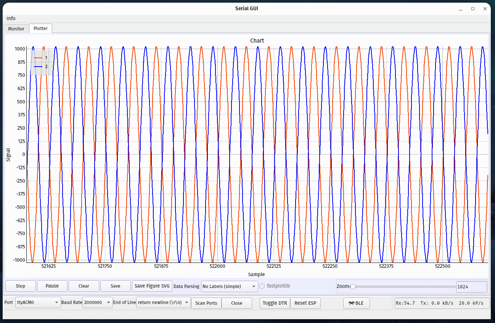

# Graphical User Interface for Serial Communication

 **SerialUI** provides a graphical interface to send and receive text and data from the serial port or BLE connection (Nordic UART Service).

It includes a serial plotter for displaying numerical data.

It offers features beyond other serial terminals. For example, in addition to features found on Arduino IDE it offers:
- Serial over BLE
- Recording of received data
- Extended charting of the data
  
Throughput is similar to other serial terminal programs.

This program is written in python using PyQt  and Bleak  as well as PyQtGraph  or fastplotlib .

Under development are binary data transmission and indicating data with display elements other than a chart.

The main program is `SerialUI.py`. It uses files in the `assets`, `docs` and `helper` folders.

When possible, workers in separate threads were utilized.

## Description
The serial monitor interface

The serial charting interface

Serial BLE extension

## How to Use This Program

- [Usage instructions](docs/Instructions.md).
- [Supplemental instructions](docs/Supplementalinstructions.md).
- [Helpful readings to learn about QT and qtgraph](docs/Helpful_readings.md).

## Installation Requirements

*One liner Windows:* 
    - `pip3 install pyqt6 pyqtgraph markdown wmi bleak`

*One liner Linux:* 
    - `pip3 install pyqt6 pyqtgraph markdown pyudev bleak`

The following python modules are needed:

- `pyqt5` or `pyqt6` user interface
- `pyqtgraph` plotting
- `fastplotlib` for high throughput plotting
- `numpy` data gathering and manipulation
- `markdown` help file
- `wmi` on Windows for USB device notifications
- `pyudev` on Linux  for USB device notifications
- `bleak` for bluetooth communication
- `numba` acceleration of numpy code

To install the optional accelerated text parser you need to navigate in your shell to the `helper` folder and then execute:
- `python3 setup.py build_ext --inplace -v`
- `pip install -e .`
 
This requires a c11 compiler and the python packages `pybind11` and `setuptools` to be available.

In future version we will also need:
- `scipy` image decompression (FFT)
- `cobs` serial data encoding (byte stuffing)
- `tamp` for compression (lightweight for microcontrollers)

## Enabling / Disabling Features

The programs configuration is stored in `config.py` (main folder). Here you can enable/disable features such as:
- USE_FASTPLOTLIB: Plotting with fastplotlib instead of pyqtgraph
- USE_BLE: enable serial communication over BLE
- USE_BLUETOOTHCTL: enable pairing and trusting of BLE devices (available on Unix like systems)

## Modules

The program is organized into these [modules](docs/Module_Organization.md).

## Nordic UART Service - BLE

The NUS provides a serial interface similar to regular USB interface for microcontrollers.
The implementation on a microcontroller requires more programming effort than a simple `Serial.print` especially if secure connections and automatic reconnection is considered. BLE connections can be optimized for low power, extended distance or high throughput.

A detailed example is the [BLE test program](./Arduino_programs/testBLESerial/testBLESerial.ino) which was used to test SerialUI.

With ESP32-S3 a transfer rate of more than 100kByte/s can be expected when BLE connection is optimized for high throughput.

## Data Parsing

The data parser extract values and variable names from lines of text. Besides a python version, there is a C accelerated version available. For supported data formats see: [Data Parsing Approach](docs/Dataparsing.md)

## Indicating Data

Indicating data is not implemented yet: [Feature not implemented yet](docs/Indicating.md).

## fastplotlib

Fastplotlib itself is under development. There is cusom legend.py in python libraries folder that is needed when you enable fastplotlib in the config file. Legends need work.

During program startup the library and the chart widget is initialized. This requires building pipeline for GPU which takes 5-10 seconds. During that time the program might be sluggish.

## Arduino Test Programs

In the `Arduino_programs` folder are example programs that simulate data for serial UART and BLE connection.

## Efficiency

A detailed [comparison of SerialUI with other serial IO programs](docs/Efficiency.md) was conducted.

The SerialUI is as performant as other terminal programs. The maximum text transfer of an ESP32-S3 over USB is about 800k bytes/s and 100k bytes/s over BLE. With a Cortex-M7 (Teensy) we reached about 7M bytes/s over USB.

With both fastplotlib and pyqtgraph we can plot two channels with at least 200k samples per second at 10Hz plotting refresh rate. When large display history is needed fastplotlib with a dedicated GPU is better suited as plotting engine.

## Packages utilized in this Project

The following libraries are used:

- [asyncio for bleak](https://docs.python.org/3/library/asyncio.html)`**`
- [bleak - BLE](https://github.com/hbldh/bleak)`**`
- [cobs - serial binary](https://github.com/cmcqueen/cobs-python)
- [fastplotlib - GPU based charting](https://fastplotlib.org/)`***`
- [datetime](https://docs.python.org/3/library/datetime.html)
- [difflib - device ID comparison](https://docs.python.org/3/library/difflib.html)
- [html - html display](https://docs.python.org/3/library/html.parser.html)
- [logging](https://docs.python.org/3/library/logging.html)
- [markdown - markdown display](https://python-markdown.github.io/)
- [math](https://docs.python.org/3/library/math.html)
- [numpy - data buffer and display](https://numpy.org/)
- [numba - accelerator](https://numba.pydata.org/)`*`
- [os](https://docs.python.org/3/library/os.html)
- [pathlib](https://docs.python.org/3/library/pathlib.html)
- [platform](https://docs.python.org/3/library/platform.html)
- [pybind11 - text parsing acceleration](https://github.com/pybind/pybind11)`*`
- [PyQt5 or 6 - UI](https://www.riverbankcomputing.com/software/pyqt/)
- [pyqtgraph - charting](https://www.pyqtgraph.org/)
- [re - regular expression filter](https://docs.python.org/3/library/re.html)
- [scipy - fft](https://scipy.org/)
- [setuptools](https://github.com/pypa/setuptools)`*`
- [tamp - compressor](https://github.com/BrianPugh/tamp)
- [textwrap - logging](https://docs.python.org/3/library/textwrap.html)
- [time](https://docs.python.org/3/library/time.html)
- [typing](https://docs.python.org/3/library/typing.html)
- [wmi - USB events](https://timgolden.me.uk/python/wmi/index.html) or [pyudev - USB events](https://pyudev.readthedocs.io/en/latest/)
- [zlib - compressor](https://docs.python.org/3/library/zlib.html)

[`*`] not required but will accelerate the program, 
[`**`] needed if BLE is enabled, 
[`***`] needed if fastplotlib is enabled

## Contributors

Urs Utzinger, 2022-2025 (University of Arizona), 
Cameron K Brooks, 2024 (Western University), 
ChatGPT (OpenAI)
